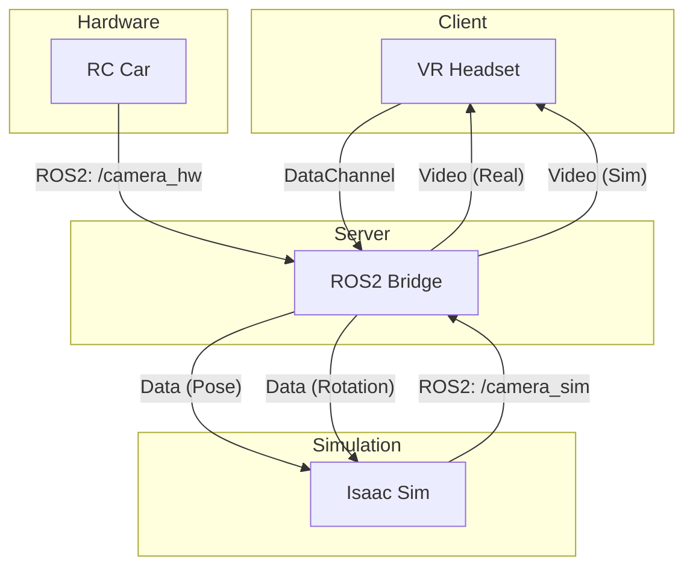
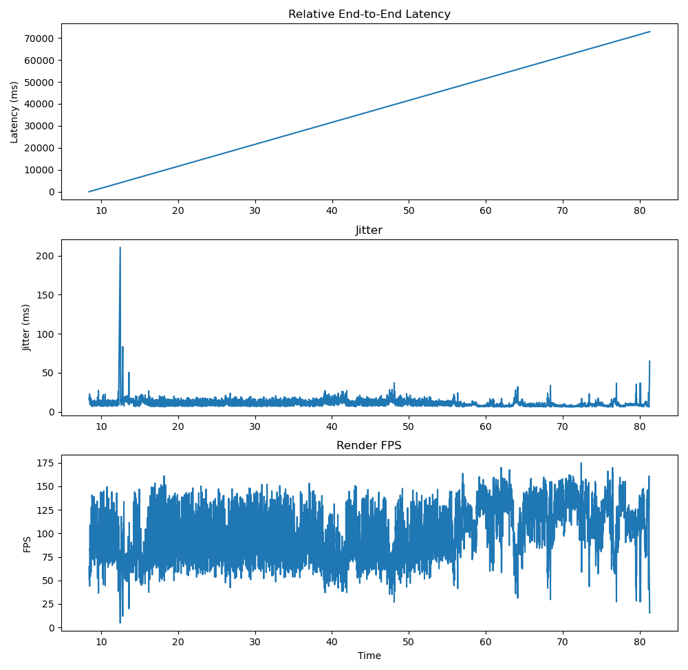

# Overview

  <video src="./utils/temp_data/pc.mp4" width="600px" autoplay loop muted playsinline></video>

This project implements a **low-latency VR teleoperation system** for real-time robotic control, integrating a VR interface, a physical RC car, and a simulation environment.

The system is designed to explore **human-in-the-loop control**, enabling seamless interaction between virtual and real-world agents through a unified streaming and control pipeline.

## System layout

## Key Components

### 1. VR Headset (Client)
Unity-based VR interface for user interaction and visualization.

- **Sends**
  - Head rotation via WebRTC DataChannel

- **Receives**
  - Real-world camera stream (RC Car)
  - Simulation camera stream (Isaac Sim)

- **Role**
  - Renders immersive VR environment
  - Provides intuitive head-driven control

---

### 2. ROS2 Bridge (Server)
Central communication node connecting WebRTC and ROS2.

- **WebRTC (aiortc)**
  - Receives: Head pose (DataChannel)
  - Sends: Dual video streams (VideoTrack ×2)

- **ROS2**
  - Publishes: `/cmd_pose`
  - Subscribes: `/camera_hw`, `/camera_sim`

- **Role**
  - Real-time data routing
  - Synchronization between control and perception

---

### 3. RC Car (Hardware)
Physical robot platform.

- Publishes:
  - Real-time camera feed → `/camera_hw`

- Role:
  - Executes control commands
  - Provides real-world visual feedback

---

### 4. Isaac Sim (Simulation)
Virtual environment for simulation and testing.

- Publishes:
  - Virtual camera feed → `/camera_sim`

- Role:
  - Provides simulated perception
  - Enables sim-to-real comparison

# Core Features

- **Low-latency teleoperation via WebRTC**
  - Real-time video streaming + control channel separation

- **Dual-stream perception**
  - Simultaneous real-world and simulated camera feeds

- **Head pose-based control**
  - Intuitive VR interaction using DataChannel

- **ROS2-based modular architecture**
  - Scalable integration of hardware and simulation

# Latency Analysis

We measured relative end-to-end latency from capture (ROS2 Bridge) to rendering (VR Headset) using timestamp alignment.

Absolute latency cannot be measured due to unsynchronized system clocks
However, relative latency trends and jitter are accurately captured, enabling analysis of system stability and performance

## Results Overview

## Results Overview

| Metric | Value |
|------|------|
| ROS Logs | 30,394 |
| Unity Logs | 7,047 |
| Capture Frames | 9,093 |
| Render Frames | 7,047 |
| Matched Frames | 7,047 |

## Latency

| Metric | Value |
|------|------|
| Mean Latency | **39,033 ms (relative)** |
| Max Latency | **72,867 ms (relative)** |

> ⚠️ Values include clock offset. Focus is on **relative trends**, not absolute numbers.

## Jitter

| Metric | Value |
|------|------|
| Mean Jitter | **10.34 ms** |

- Jitter directly impacts **VR stability and user comfort**  
- Observed fluctuations indicate **network / pipeline variability**  

## FPS (Rendering Performance)

| Metric | Value |
|------|------|
| Mean FPS | **104.53 FPS** |

- Stable high FPS indicates **smooth rendering performance**  
- Rendering is **not the primary bottleneck** in the pipeline  

## 🖼️ Visualization

## Key Insights

- **Latency spikes** are the main source of instability, not average delay  
- **Jitter (~10ms)** is a critical factor affecting VR experience  
- **High FPS (~104)** confirms rendering pipeline is stable  
- System bottlenecks are likely in:
  - network transmission  
  - encoding / streaming pipeline  